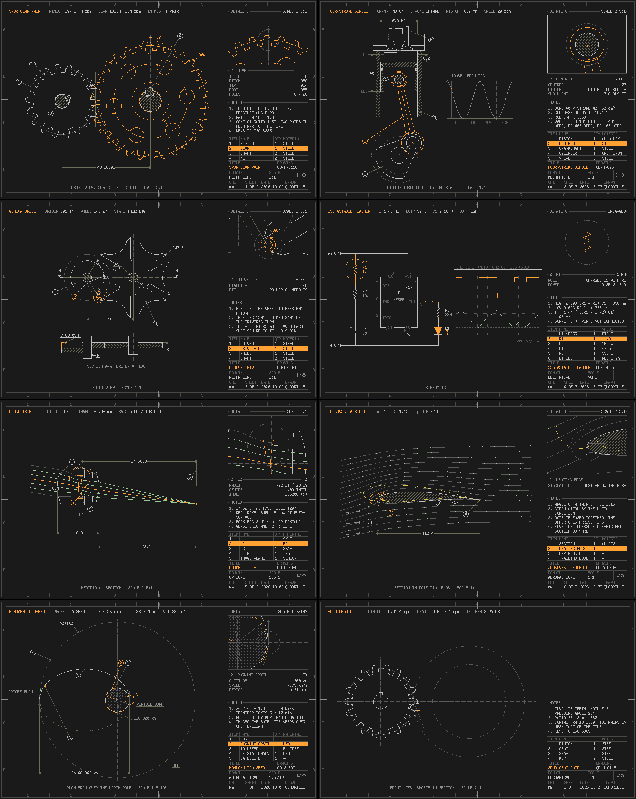
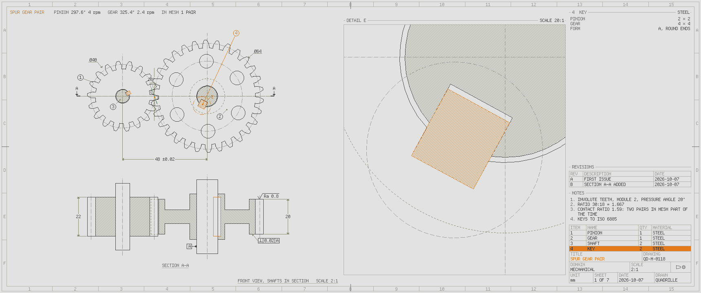

# omarchy-quadrille

[quadrille](https://github.com/jwric/quadrille)'s pixel-perfect look on an
[Omarchy](https://github.com/basecamp/omarchy) desktop: its five palettes as
Omarchy themes, Departure Mono drawn without antialiasing in every toolkit, a
whole-pixel QML bar, menu, OSD and notifications for the Omarchy shell, and
panels drawn by quadrille itself as Wayland layer-shell surfaces.

Each monitor's wallpaper, APERTURE, is a calibrated technical portrait of that
display, drawn on its own pixel grid. Its click-through cursor draws live CAD
measurements that update as the pointer moves whenever the overlay is enabled.
When the desktop is idle, the screensaver plots technical drawings on every
monitor, mechanisms and the machine it runs on, and documents them part by part
as they run.


It is four layers, each useful without the next:

| | what | where |
|---|---|---|
| 1. Themes and font | five Omarchy themes generated from quadrille's palettes (terminal, paper, phosphor, amber, lcd), a dithered graticule wallpaper, square whole-pixel Hyprland borders and gaps, no animation; a fontconfig rule that turns antialiasing off for Departure Mono | `themes/`, `fontconfig/`, `tools/` |
| 2. Shell plugins | a QML kit (lamps, gauges, tabs, groups, 24 pixel icons, text from baked bitmaps), a replacement `quadrille.bar`, and restyled menu, OSD and notifications | `plugins/` |
| 3. Panel host | `quadrille-bar`, an iced app on a layer-shell windowing shell of its own (sctk + tiny-skia): system, audio, network, Bluetooth and power panels, plus a cursor graticule, following the Omarchy theme live | `layershell/` |
| 4. Screensaver | `quadrille-screensaver`, on the same shell: technical drawings that plot themselves, run and document their parts, subject after subject, at true scale on calibrated displays | `layershell/crates/screensaver/` |

## Use

Needs an Omarchy 4 desktop (Hyprland, Quickshell) and a checkout of
[quadrille](https://github.com/jwric/quadrille) beside this one (or
`QUADRILLE=/path`): the fonts and the palettes come from it. Building the panel
host and the screensaver (layers 3 and 4) also takes a Rust toolchain (`cargo`)
and libxkbcommon, the one system library they link (Hyprland needs it too); the
first build downloads its dependencies, among them quadrille and the iced fork,
from GitHub.

```sh
tools/install.sh                           # link the themes, install Departure Mono and its fontconfig rule
omarchy theme set "Quadrille Terminal"     # or Paper, Phosphor, Amber, Lcd
omarchy font set "Departure Mono"

plugins/install.sh                         # the bar, menu, OSD, notifications, CPU/MEM gauges
plugins/install.sh idle                    # optional: start the screensaver when idle
plugins/stock.sh                           # the stock Omarchy shell again

layershell/tools/install.sh                # builds quadrille-bar and quadrille-screensaver into
                                           # ~/.local/bin and prints the lines to add
```

`tools/install.sh` also sets up **foot**: a user-level `foot.desktop` runs
`tools/quadrille-foot`, which picks Departure Mono's pixel size from the focused
monitor's scale so every glyph edge is on the pixel grid (11 px at scale 1, 13.2 px at
1.666667, both exact multiples of the font's native 11 px; a plain point size such as 9
is off the grid on both). Your `foot.ini` is not touched. `QUADRILLE_FOOT_MULTIPLE=2` or
`3` makes the terminal's pixels the same size as the shell's, with chunkier text. To undo,
delete `~/.local/bin/quadrille-foot` and `~/.local/share/applications/foot.desktop`.
`tools/term-test.sh` renders candidates in a nested compositor at both scales.

**Measuring overlay key.** The cursor reticle and live dimension lines are off at login
(`quadrille-bar --no-bar --no-overlay`); `SUPER + CTRL + G` runs `tools/quadrille-overlay-toggle`
(linked to `~/.local/bin`) to turn them on and off. `quadrille-bar ctl overlay on|off|status` does the same by hand.

**Screensaver.** `quadrille-screensaver-launch force` runs it now; any key,
click or pointer movement ends it. `plugins/install.sh idle` has the desktop
start it when idle: Omarchy's idle service, cloned with two changes, starts the
launcher (which falls back to the stock screensaver) and counts the
screensaver's surfaces as the stock one's window, so the lock still comes on
time. It is opt-in, like the lock screen, because the idle service also decides
when the screen locks. The launcher honours Omarchy's screensaver switch, runs
as `org.omarchy.screensaver` (so `omarchy-system-lock` stops it) and logs to the
journal (`journalctl -t quadrille-screensaver`). For the menu's *Screensaver*
entry, add to `~/.config/omarchy/extensions/omarchy-menu.jsonc` (the icon and
label too: the menu labels an override without them by its id):

```jsonc
"system.screensaver": {"icon":"󱄄","label":"Screensaver","action":"quadrille-screensaver-launch force"},
```

Nothing here edits your Hyprland config; the scripts print what to add. Crisper
shell text wants one line in it: `hl.env("QML_DISABLE_DISTANCEFIELD", "1")`
(Qt's distance-field text renderer smears a pixel font; this turns it off for
the shell).

Back to how it was: `omarchy theme set <your theme>`, `omarchy font set <your
font>`, `plugins/stock.sh`, and delete
`~/.config/fontconfig/conf.d/60-quadrille-pixel.conf`.

> **Plugins run unsandboxed inside `omarchy-shell`.** Read `plugins/` before
> enabling it. The clones execute what the Omarchy plugins they come from
> execute, and nothing else (see `plugins/NOTES.md`).

## Pixel scale

A virtual pixel is a whole number of physical pixels: `max(1, round(2 × monitor
scale))`. A monitor at scale 1 gets 2, at 1.666667 gets 3 (the logical size is
then 1.8 per virtual pixel; both the QML kit and the panel host work in device
pixels), at 2 gets 4. The themes' shell and Hyprland sizes assume 2 logical
pixels (`tools/gen_themes.py --unit`).

## Display calibration and cursor overlay

Centimetre-rounded EDID is snapped to a nominal panel family, then width and
height follow the native pixel aspect. The author's laptop and its Dell
ultrawide resolve to 344.6 × 215.4 mm and 796.6 × 333.5 mm; these are inferred
sizes. A mark rounds to the nearest vpx: 0.404 mm on the laptop, 0.463 mm on the
Dell. The sheet's mark-error bound is
half a vpx, conservatively rounded upward; it is not a calibration guarantee.
Missing EDID uses an explicitly estimated density and `~` labels.

Each output draws its own static sheet, APERTURE: the monitor's number beside a
miniature of the configured desktop layout; a calibrated Siemens star (100 mm on the
laptop, 180 on the Dell) whose diameter dimension is a true-size millimetre scale;
DETAIL A, the disc inside the star's grid-limit ring redrawn 6:1 on the panel's own
pixels; B, one virtual pixel taken apart into its 3 x 3 (laptop) or 2 x 2 (Dell) panel
pixels beside an edge of the star at both resolutions; fine stripes beside what the
grid really draws from them (resolved, false detail, detail lost); a dimensioned
elevation of the active area at a true 1:N; the theme's roles as surfaces, inks and
signals. Inferred sizes are marked ESTIMATED; unknown ones carry `~`. Binary patterns
are precomputed into an exact texture on display/theme events; the wallpaper does no
work between changes. The live cursor overlay is separate. Design notes:
`plugins/NOTES.md`, "Design".

An optional `~/.config/quadrille/displays.toml` supplies measured dimensions.
Nothing creates it by default. Replace these example sizes with measurements;
output names take priority over make/model keys:

```toml
["eDP-2"]
width_mm = 344.6
height_mm = 215.4

["Dell Inc. DELL U3417W"]
width_mm = 797.2
height_mm = 333.7
# Alternatively, diagonal_inches = 34.0 (without width_mm/height_mm).
```

The `diagonal_inches` configuration key accepts manufacturers' nominal panel
sizes; all on-screen labels remain metric. Width and height describe the
native panel before rotation. Provide both dimensions or a diagonal.

The overlay starts by default in every host mode, including `--no-bar`:

```sh
quadrille-bar --no-bar                     # panels and cursor overlay
quadrille-bar --no-bar --no-overlay        # start with overlay disabled
quadrille-bar --no-bar --overlay-rest-ms 300 # small reticle until 300 ms of rest
quadrille-bar ctl overlay on
quadrille-bar ctl overlay off
quadrille-bar ctl overlay status
```

The switch lasts until the host exits. `--overlay-rest-ms N` defaults to 0 (live);
positive values keep a small reticle while moving and show dimensions after N ms
of rest. Cursor IPC adapts from 60 Hz to 5 Hz; fullscreen and lock suppress the
overlay. Dimensions show the nearest horizontal
and vertical screen distances (`S`) and, over a visible window, its nearest
horizontal and vertical edges (`W`). Plates avoid one another; spanning-window
edges on another output are omitted. Values are whole millimetres because IPC
reports whole logical pixels. Motion repaints and damages only changed line and
plate rectangles in reusable buffers; window geometry is queried at about 4 Hz
and on window events. Off and suppression free the large surface. Only read-only
compositor IPC is sent by the host.

Nested measurements (one core / RSS): moving with dimensions costs 1.55% / 25.02
MiB on QA (2560 × 1600 at 1.666667), 1.52% / 28.26 MiB on QB (3440 × 1440 at 1).
Still costs 0.13–0.18%; off costs 0.00% / 9.30 MiB. Details are in `layershell/NOTES.md`.

If a compositor configuration still fades layers, this **optional** line belongs
in the user's own Lua config (the host never installs it):
`hl.layer_rule({match={namespace="^quadrille-(reticle|dimensions)$"},no_anim=true})`

Off/on reloads display overrides. The wallpaper watches existing overrides;
`omarchy-shell background refresh` also loads a newly created file.

## Screensaver



`quadrille-screensaver` covers every output with a drawing sheet. A pen plots
the subject stroke by stroke as a drafting office draws it, the title block
and parts list filling in as it goes; then the subject runs, and each part in
turn is picked out, magnified in a detail view and specified beside it, until
a wipe clears the sheet for the next. Each output starts on a different
subject.

| subject | what moves, and how it is worked out |
|---|---|
| Spur gear pair | involute teeth (module 2, 20°, 18:30) in mesh; the contact points slide along the line of action |
| Four-stroke single | slider-crank, valves on their timing, a spark; piston travel charted live |
| Geneva drive | six slots indexed a sixth of a turn per turn, held by the locking disc between |
| 555 astable | the RC charge and discharge, current along the path that carries it, a sweeping two-channel scope |
| Cooke triplet | real rays traced through six spherical surfaces by Snell's law as the field sweeps to 20° |
| Joukowski aerofoil | potential flow with the Kutta condition; particles released together, the upper ones arrive first |
| Hohmann transfer | LEO to GEO by Kepler's equation, the burns, the Earth turning under the satellite |
| This computer | three sheets of the machine it runs on, read from `/sys` and `/proc` without root: its topology, with traffic along the buses at the measured I/O rates; its displays side by side at their true sizes; its cooling, the fans turning at their measured speeds |



The sheets keep a drawing office's conventions: views and sections lined up by
first-angle projection, limits and fits, surface finish, datums and geometric
tolerances, and balloons that place themselves, at a preferred scale that is
true on the display's calibration (the gears are 2:1 on both of the author's
monitors). The machine's own sheets never read serial numbers, hardware
addresses, UUIDs, or host and user names; `--machine fixture` draws a made-up
laptop instead (`fixture-desktop`, `fixture-server` and `fixture-vm` the other
kinds), and every image of them in this repository is drawn from one.

```sh
quadrille-screensaver --subject cooling   # start on one sheet
quadrille-screensaver render --subject gears --at 12,20 --output ultrawide --theme paper
quadrille-screensaver list                # the subjects
```

`render` draws any moment of any sheet offscreen to PNG, as an output shows it
(`--size 1366x768` for a display other than the author's), and `bench` times
the drawing and the repaint. Design notes: `docs/screensaver.md`,
`docs/plotter.md` for how the pen plots, and `docs/this-computer.md` for the
machine's sheets.

## What is not exact

- The stock widgets the bar keeps (tray, agents, indicators, weather), popup
  text and sliders, and application icons are the shell's own and are not on the
  grid at fractional scales. A plugin cannot restyle the host's UI components;
  `plugins/NOTES.md` lists what a plugin can and cannot override.
- The shell passes a third-party menu clone no application library on Omarchy
  4.0.4, so `quadrille.menu` reads desktop entries itself (no hidden-entries
  filter, no launch feedback).
- Physical calibration infers nominal diagonals from rounded EDID data. Use
  measured overrides when tighter physical accuracy matters.
- The screensaver's sheets of the machine itself are checked on a laptop and on
  made-up desktops, servers and virtual machines, not on every machine. On a
  view smaller than about 1366 × 768 at scale 1, the topology is drawn smaller
  than its lettering wants. See `docs/this-computer.md`, "Limits".

## Layout

```
themes/        generated by tools/gen_themes.py from quadrille's theme.rs
fontconfig/    antialiasing and subpixel colour off for Departure Mono
tools/         gen_themes.py, install.sh
plugins/       the QML kit and plugins, NOTES.md (findings), screenshots/
layershell/    the panel host and the screensaver: windowing shell, shared desktop crate
               (theme, calibration), bar and screensaver crates, nested-compositor tests; NOTES.md
docs/          the screensaver's design: screensaver.md, plotter.md, this-computer.md
```

`layershell/` depends on quadrille and on the
[pixel-scale iced fork](https://github.com/jwric/iced/tree/0.15-pixel-scale) as
git dependencies (uncomment the `[patch]` in `layershell/Cargo.toml` to build
against local checkouts). Tests inject input only inside a nested Hyprland.
Its temporary visible window and empty-workspace previews take the desktop lock.

## Licence

Original code: MIT OR Apache-2.0 (`LICENSE-MIT`, `LICENSE-APACHE`). The plugin
clones derive from Omarchy (MIT) and keep its notice; Departure Mono is by
Helena Zhang under the SIL Open Font License. See `NOTICE`.
