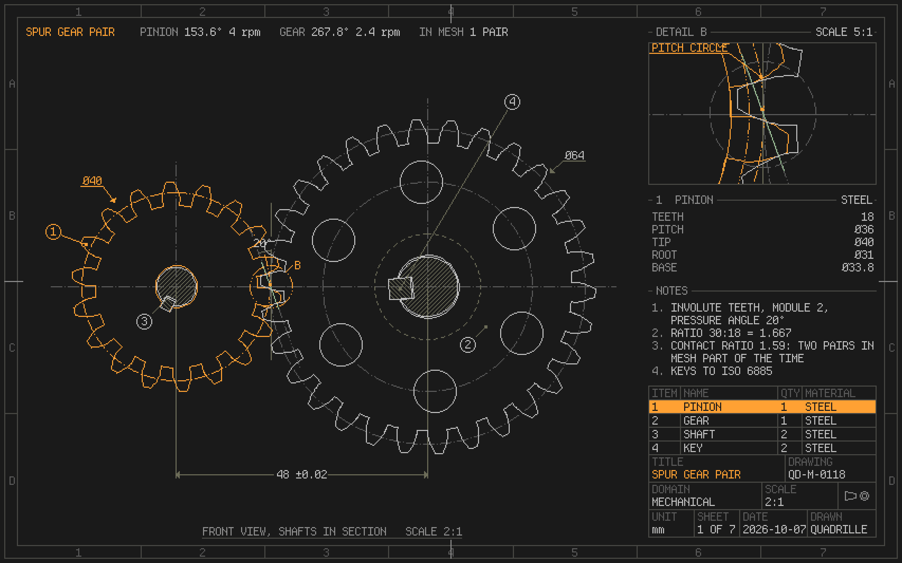
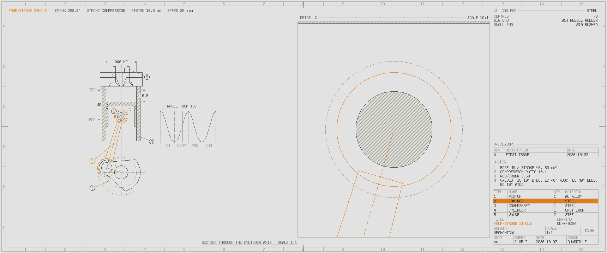
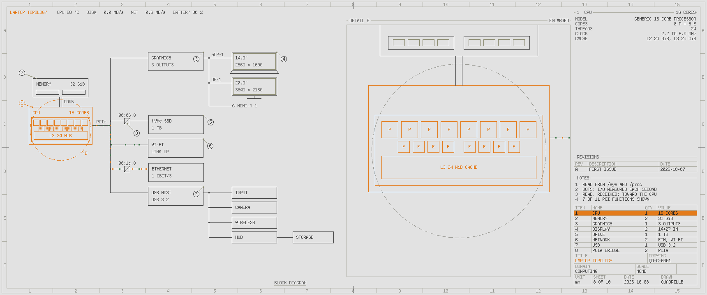

# quadrille-screensaver

Technical drawings that plot themselves while the desktop is idle. This is the
design behind the screensaver; the README says how to install and run it. The
sheets of the machine the screensaver runs on have their own notes in
[`this-computer.md`](this-computer.md).



## How a sheet goes

Every output shows a sheet of its own, and each sheet's life is a function of
the time since it began, so any moment of it can be drawn again exactly:

1. The title block types itself in, and the pen plots the drawing stroke by
   stroke in a plotter's order: construction and centre lines, edges, hidden
   lines, sections, traces, then the dimensions, notes and balloons.
2. The subject starts to move. After a beat, each part in turn is picked out:
   lit in the accent, ringed on the view, magnified in a detail view (which
   follows a part that moves) and specified beside it.
3. The subject runs on its own a while, and a wipe clears the sheet for the
   next one.

Each output draws its subjects from a shuffle of its own: every subject comes
round once a round, never twice running and never on two outputs at once. Any
key, click or pointer movement ends the screensaver, and the cursor is hidden
only over its own surfaces.

## How it draws

A subject draws itself in its own units, millimetres or whatever suits it, on a
`Draft`: lines of each type, hatching, dimensions, notes, balloons, and for a
schematic its symbols (`subjects/schematic.rs`). The draft only records marks.
The sheet decides where they land: it puts them on the pixel grid through a
projection, once for each view and again, larger, for a detail, and plots them
a piece at a time. Lettering, patterns and line types are whole virtual pixels,
in the Omarchy theme's roles; lettering is drawn whole or not at all, so a value
at the edge of a view is never cut short.

What does not move is drawn once and kept, and only what moves is drawn again
each frame, so the renderer repaints no more than the motion. The panel host's
iced fork compares kept and live drawings piece by piece for this, which is
what keeps the plot, the wipe and the run cheap on the software renderer.
`quadrille-screensaver bench` times each stage headless: drawing the sheet, and
repainting what changed as a live surface does.

## A drawing office's conventions



- **Scale.** A drawing to scale takes a preferred scale (ISO 5455, with DIN
  823's 2.5) that is true on the display's calibration (see the README's
  display calibration): the engine is 1:1 on both of the author's monitors and
  the gears 2:1. On a display whose size is only estimated, the scale reads
  `~2:1`.
- **Views.** Views line up as first-angle projection places them. The gears
  and the Geneva drive are sectioned through their shafts under the front view,
  behind a cutting plane: bodies are lined, each part its own way; teeth,
  shafts, keys and pins are left whole; where gears mesh, the teeth behind are
  hidden. On the laptop, a view goes in only if it fits at the front view's
  scale.
- **Annotation.** Dimensions carry limits and fits (`48 ±0.02`, `Ø8 H7/k6`),
  surfaces their finish (`√ Ra 0.8`), and features their datums and geometric
  tolerances in feature control frames. The title block has the first-angle
  projection symbol and, where the column has room, a revision table.
- **Placement.** Balloons and notes place themselves: lined up beside the
  drawing, or just off what they point at, whichever hides least of the drawing
  and crosses least of it. A balloon on a moving part steps out of the way of
  lettering it would cover.

## Adding a subject

A subject is one file in `layershell/crates/screensaver/src/subjects/`. It draws
itself on a `Draft` at a moment of its motion, and fills in a card: a title,
notes, and its parts with their specifications and detail circles. Plotting,
scale, the sheet, details and timing are the sheet's, the same for every
subject. Add the type to `subjects::all()`; the tests check that every part is
drawn, that names fit the parts list, and that lettering stays clear of other
lettering on both of the desk's outputs.

`render` draws any moment of any sheet offscreen to PNG, exactly as an output
shows it; it is how the sheets are designed, with no window opened:

```sh
quadrille-screensaver render --subject gears --at 12,20 --output ultrawide --theme paper
quadrille-screensaver render --subject cooling --at 30 --size 1920x1080 --machine fixture-desktop
quadrille-screensaver render --subject engine --at 24 --physical    # at the panel's own pixels
quadrille-screensaver bench --output laptop
```


